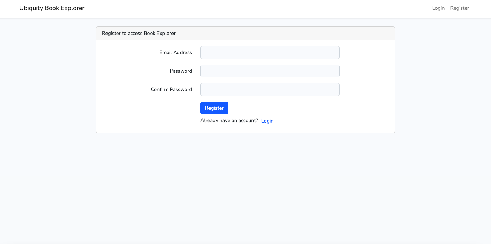
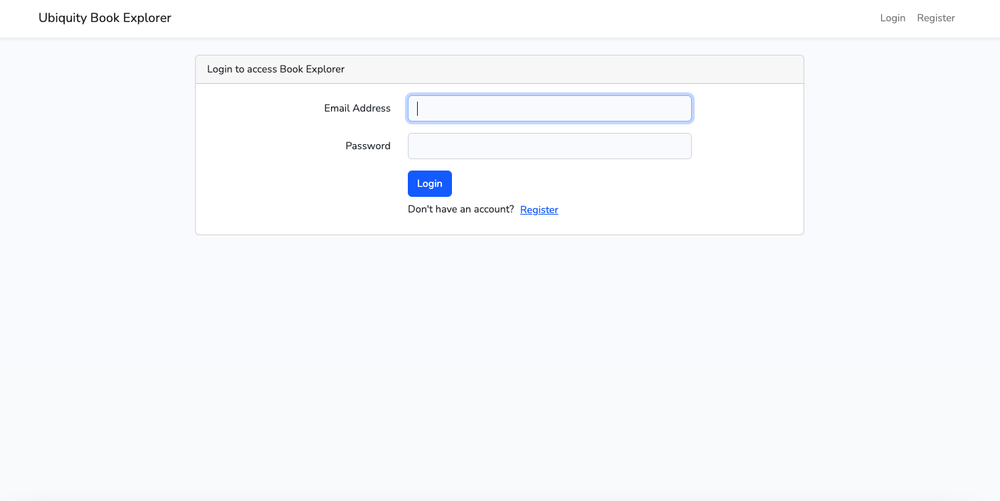
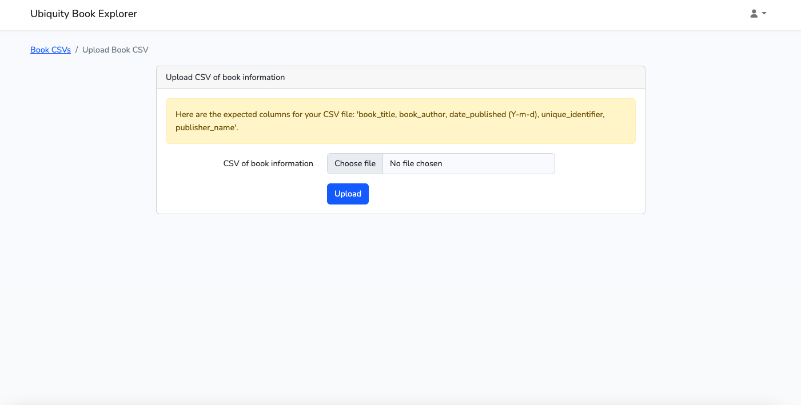
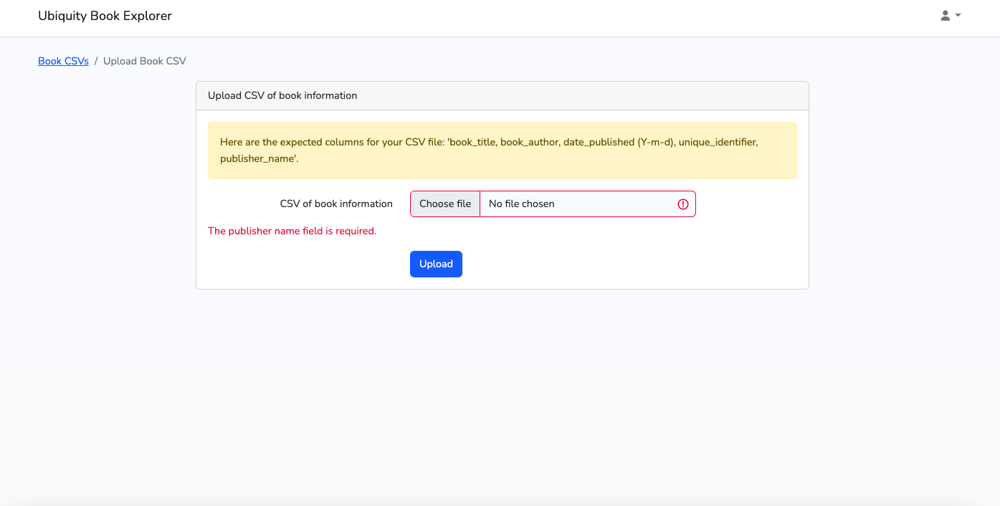
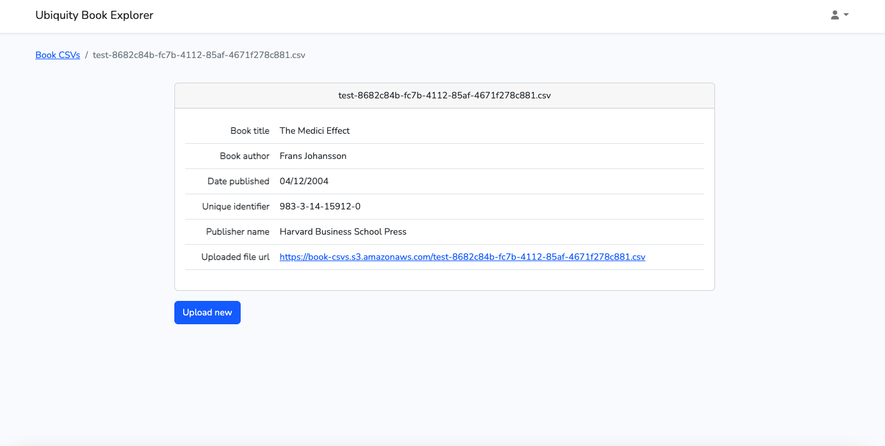
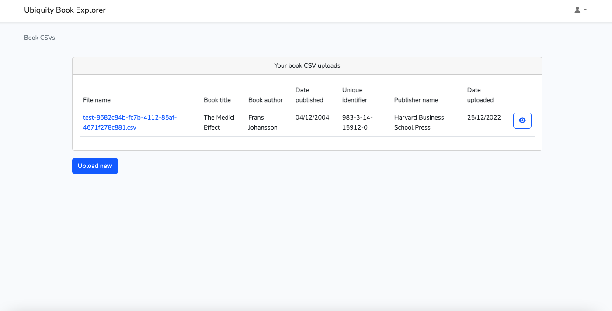

# Ubiquity Book Explorer

App allowing uploading of csv files detailing books. Files are uploaded to public amazon s3 bucket and their data is stored in a database.
Upon upload url of uploaded file is sent in a POST request to this url: https://postman-echo.com/post.
Feature tests written.

Deployed at:
 
https://book-explorer-rob.herokuapp.com/

Repository:
 
https://github.com/MrRob100/laravel-book-explorer

